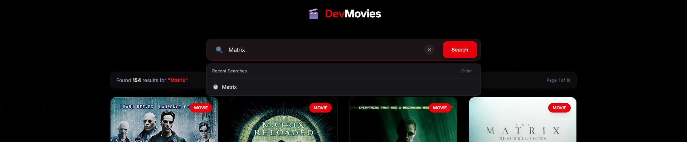
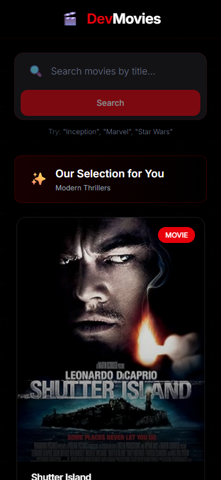
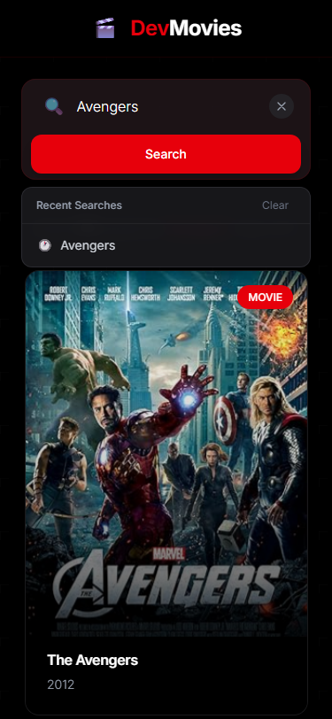

# 🎬 DevMovies

A modern, highly accessible movie search application built with React 19, Vite, and Tailwind CSS 4. Features custom hooks, comprehensive testing, and a polished user experience.

[](https://montagne-imdb.vercel.app)
[]()
[]()

> **Note:** Screenshots coming soon! The app is live at the demo link above.

---

## 📋 Table of Contents

- [Features](#-features)
- [Tech Stack](#-tech-stack)
- [Getting Started](#-getting-started)
- [Project Structure](#-project-structure)
- [Architecture Decisions](#-architecture-decisions)
- [Technical Decisions](#-technical-decisions)
- [Custom Hooks](#-custom-hooks)
- [Testing](#-testing)
- [Deployment](#-deployment)
- [Future Improvements](#-future-improvements)

---

## ✨ Features

### Core Functionality
- 🔍 **Smart Search** - Search thousands of movies with intelligent error handling
- 📱 **Fully Responsive** - Mobile-first design that works beautifully on all devices
- ⌨️ **Keyboard Shortcuts** - `/` to focus search, `Escape` to clear (GitHub-style)
- 💾 **Recent Searches** - Persistent search history with suggestions (localStorage)
- 🎯 **Movie Details Modal** - Comprehensive information including ratings, cast, plot
- 📄 **Smart Pagination** - Custom 12-results-per-page implementation

### User Experience
- ♿ **Accessibility First** - ARIA labels, semantic HTML, keyboard navigation
- 🎨 **Modern UI** - Tailwind CSS 4 with custom animations and micro-interactions
- ⚡ **Performance** - Optimized rendering, lazy loading, efficient state management
- 🎲 **Discovery Mode** - Random movie collections on page load
- 🌈 **Visual Polish** - Gradient effects, smooth transitions, loading states

### Developer Experience
- 🧪 **Comprehensive Testing** - Unit tests (Jest) + E2E tests (Playwright)
- 🔧 **Custom Hooks** - Reusable logic for localStorage and keyboard shortcuts
- 📚 **Well Documented** - Clean code with extensive inline documentation
- 🚀 **Modern Tooling** - Vite for instant HMR and fast builds

---


## 📸 Screenshots

### 🖥️ Desktop Experience

#### Homepage with Curated Collections

*Random movie collections on every visit - discover new films effortlessly*

#### Search Results

*Fast, intuitive search with smart pagination (12 results per page)*

#### Movie Details Modal

*Comprehensive movie information with ratings, cast, plot, and awards*

#### Recent Searches Feature

*Persistent search history with autocomplete - powered by localStorage*

#### Keyboard Shortcuts in Action

*Press `/` to focus search, `Escape` to clear - GitHub-style UX*

---

### 📱 Mobile Experience

<p align="center">
  
  
  
</p>

*Fully responsive design - beautiful on all devices*

---

### ⚠️ Error Handling


*User-friendly error messages with helpful suggestions*

---

## 🛠️ Tech Stack

| Technology | Version | Purpose |
|------------|---------|---------|
| **React** | 19.2.0 | UI library with latest features |
| **Vite** | 7.1.7 | Build tool for instant HMR |
| **Tailwind CSS** | 4.1.16 | Utility-first CSS framework |
| **Jest** | 30.2.0 | Unit testing framework |
| **Playwright** | 1.56.1 | End-to-end testing |
| **OMDb API** | - | Movie database |

---

## 🚀 Getting Started

### Prerequisites

- Node.js 18+ 
- npm or yarn
- OMDb API Key ([get yours free](https://www.omdbapi.com/apikey.aspx))

### Installation

1. **Clone the repository**
```bash
git clone https://github.com/rodrigofrende/montagne-imdb.git
cd montagne-imdb
```

2. **Install dependencies**
```bash
npm install
```

3. **Set up environment variables**

Create a `.env` file in the root directory:
```bash
VITE_OMDB_API_KEY=your_api_key_here
```

4. **Start development server**
```bash
npm run dev
```

5. **Open your browser**
```
http://localhost:5173
```

### Available Scripts

```bash
# Development
npm run dev          # Start dev server with HMR
npm run build        # Build for production
npm run preview      # Preview production build

# Testing
npm test             # Run unit tests
npm run test:watch   # Run tests in watch mode
npm run test:coverage # Generate coverage report
npm run test:e2e     # Run E2E tests
npm run test:e2e:ui  # Run E2E with Playwright UI
npm run test:all     # Run all tests (unit + E2E)
```

---

## 📁 Project Structure

```
montagne-imdb/
├── src/
│   ├── components/              # React components
│   │   ├── __tests__/          # Component tests
│   │   ├── MovieCard.jsx       # Individual movie display
│   │   ├── MovieGrid.jsx       # Grid layout wrapper
│   │   ├── MovieModal.jsx      # Detailed movie view
│   │   ├── Pagination.jsx      # Custom pagination
│   │   └── SearchBar.jsx       # Search with autocomplete
│   │
│   ├── hooks/                   # Custom React hooks
│   │   ├── __tests__/          # Hook tests
│   │   ├── index.js            # Hook exports
│   │   ├── useLocalStorage.js  # Persistent state hook
│   │   ├── useKeyboardShortcut.js # Keyboard handler
│   │   └── README.md           # Hook documentation
│   │
│   ├── services/                # External services
│   │   ├── __tests__/          # Service tests
│   │   └── omdbApi.js          # OMDb API integration
│   │
│   ├── context/                 # React Context (future)
│   ├── pages/                   # Page components (future)
│   ├── utils/                   # Utility functions (future)
│   │
│   ├── App.jsx                  # Main app component
│   ├── main.jsx                 # App entry point
│   └── index.css                # Global styles + animations
│
├── e2e/                         # E2E test specs
├── public/                      # Static assets
├── coverage/                    # Test coverage reports
├── dist/                        # Production build
│
├── .env                         # Environment variables (gitignored)
├── vercel.json                  # Vercel deployment config
├── vite.config.js              # Vite configuration
├── jest.config.js              # Jest configuration
├── playwright.config.js        # Playwright configuration
└── package.json                # Dependencies & scripts
```

---

## 🏗️ Architecture Decisions

### Component Architecture

**Single Page Application (SPA)**
- No routing library needed (removed `react-router-dom`)
- All interactions happen on one page
- Modal-based navigation for movie details
- Simpler state management and better performance

**Component Hierarchy:**
```
App (State Management)
├── SearchBar (Search Logic + Keyboard Shortcuts)
├── MovieGrid (Layout)
│   └── MovieCard[] (Individual Cards)
├── Pagination (Page Navigation)
└── MovieModal (Detail View)
```

**State Management:**
- Local React state (`useState`) for UI state
- Custom hooks for cross-cutting concerns
- No Redux/Context needed (avoiding over-engineering)
- Props drilling is minimal and intentional

### Custom Hooks Philosophy

We follow a **"build when needed"** approach:

✅ **Current Hooks (2):**
- `useLocalStorage` - Powers recent searches feature
- `useKeyboardShortcut` - Powers keyboard navigation

❌ **No Speculative Code:**
- No unused hooks "just in case"
- Every hook serves a real, current purpose
- Easy to add new hooks when features require them

See [Custom Hooks](#-custom-hooks) section for details.

### Styling Strategy

**Tailwind CSS 4 with Utility-First Approach:**
- No custom CSS files except global animations
- Consistent spacing using Tailwind scale
- Component-level styling with inline classes
- Mobile-first responsive design

**Color System:**
- **Primary:** Red (`#dc2626`) - Montagne brand
- **Background:** Pure black with subtle grid pattern
- **Surfaces:** Zinc-900/800 for cards and modals
- **Text:** White primary, gray-scale secondary
- **Accents:** Red for interactive elements

### API Strategy

**Custom Pagination Implementation:**
- OMDb API returns 10 results/page
- We display 12 results/page for better grid layout
- Solution: Fetch from 2 API pages when needed
- Smart offset calculation for seamless UX

**Error Handling:**
- User-friendly error messages
- Specific handling for "too broad" searches
- Suggested searches on errors
- Graceful fallbacks

---

## 🤔 Technical Decisions

### Why We Removed React Router

**Initial Setup:** Project started with `react-router-dom`

**Reason for Removal:**
- Single page app doesn't need routing
- No separate pages or URLs to manage
- Simpler mental model for users and developers
- Better performance (no route matching overhead)
- Smaller bundle size (~50KB saved)

**Alternative Solution:**
- Modal for movie details instead of separate page
- State management for UI transitions
- Cleaner, simpler codebase

### Why Tailwind CSS 4

**Upgraded to Latest Version:**
- Native Vite plugin (`@tailwindcss/vite`)
- Faster builds with new engine
- Better TypeScript support
- Modern CSS features
- Improved performance

**Benefits:**
- Zero-config setup with Vite
- Instant HMR for styles
- Smaller production CSS
- Better developer experience

### Why Custom Hooks

**Problem:** Repetitive logic across components

**Solution:** Reusable hooks for common patterns

**Benefits:**
- `useLocalStorage` - Single source of truth for persistence
- `useKeyboardShortcut` - Declarative keyboard handling
- Testable in isolation
- Composable and reusable
- Better code organization

**Philosophy:** Build hooks when you need them, not before.

### Why Jest + Playwright

**Two-Layer Testing Strategy:**

**Jest (Unit Tests):**
- Fast feedback loop
- Test logic in isolation
- High coverage easily achieved
- Great debugging experience

**Playwright (E2E Tests):**
- Real browser testing
- User workflow validation
- Cross-browser support
- Visual regression potential

**Result:** Confidence in both logic and UX

### Why Vite over Create React App

**Performance:**
- Instant server start
- Lightning-fast HMR
- Optimized production builds

**Developer Experience:**
- Native ES modules
- Better error messages
- Modern tooling
- Active development

**Future-Proof:**
- CRA is deprecated
- Vite is industry standard
- Better ecosystem support

---

## 🎣 Custom Hooks

### 1. `useLocalStorage`

Syncs React state with localStorage automatically.

**Usage:**
```javascript
import { useLocalStorage } from './hooks';

const [recentSearches, setRecentSearches] = useLocalStorage('key', []);
```

**Implementation:**
```javascript
// Saves to localStorage on every update
// Loads from localStorage on mount
// Handles JSON serialization automatically
// Same API as useState
```

**Current Use Case:**
- Recent searches (last 5 queries)
- Persists across browser sessions
- Powers autocomplete suggestions

**Tests:** ✅ 8 unit tests with full coverage

### 2. `useKeyboardShortcut`

Declarative keyboard shortcut handling.

**Usage:**
```javascript
import { useKeyboardShortcut } from './hooks/useKeyboardShortcut';

// Focus search on "/"
useKeyboardShortcut('/', () => inputRef.current?.focus());

// Clear on "Escape"
useKeyboardShortcut('Escape', handleClear);

// Save with Ctrl+S
useKeyboardShortcut('s', handleSave, { ctrlKey: true });
```

**Features:**
- Works with any keyboard layout
- Optional modifier keys (Ctrl, Shift, Alt)
- Prevents default browser behavior
- Cleans up automatically on unmount

**Current Use Cases:**
- `/` - Focus search bar (GitHub-style)
- `Escape` - Clear search input
- Improves accessibility and power-user UX

**Tests:** ✅ Integration tests via SearchBar

---

## 🧪 Testing

### Test Coverage

```bash
# Coverage achieved
Branches: 72%
Functions: 70%
Lines: 78%
Statements: 78%
```

### Unit Tests (Jest + React Testing Library)

**Components Tested:**
- ✅ SearchBar - Input validation, submission, keyboard shortcuts
- ✅ MovieCard - Rendering, interactions, accessibility
- ✅ Pagination - Navigation, disabled states, edge cases

**Services Tested:**
- ✅ omdbApi - API calls, error handling, pagination logic

**Hooks Tested:**
- ✅ useLocalStorage - Persistence, updates, edge cases

**Run Tests:**
```bash
npm test                  # Run all tests
npm run test:watch        # Watch mode
npm run test:coverage     # Coverage report
```

### E2E Tests (Playwright)

**Scenarios Tested:**
- ✅ Initial page load with random collection
- ✅ Search functionality and results
- ✅ Pagination navigation
- ✅ Movie modal interaction
- ✅ Keyboard shortcuts (`/` and `Escape`)
- ✅ Error handling (invalid searches)
- ✅ Responsive design (mobile/desktop)
- ✅ Recent searches persistence

**Run E2E Tests:**
```bash
npm run test:e2e          # Headless
npm run test:e2e:ui       # With Playwright UI (recommended)
npm run test:e2e:headed   # Visible browser
```

### Testing Philosophy

**Priorities:**
1. Test user behavior, not implementation details
2. High coverage for critical paths
3. Fast unit tests, comprehensive E2E tests
4. Readable test descriptions

**Example:**
```javascript
test('shows recent searches when focusing input', async () => {
  // ✅ Good: Tests user-visible behavior
  const user = userEvent.setup();
  render(<SearchBar recentSearches={['Matrix']} />);
  
  await user.click(screen.getByRole('textbox'));
  
  expect(screen.getByText('Matrix')).toBeInTheDocument();
});
```

---

## 🚀 Deployment

### Vercel

The app is configured for zero-config Vercel deployment.

**One-Click Deploy:**
```bash
npm i -g vercel
vercel login
vercel --prod
```

**Environment Variables:**
Add `VITE_OMDB_API_KEY` in Vercel dashboard:
1. Project Settings → Environment Variables
2. Add `VITE_OMDB_API_KEY` = your API key
3. Select all environments (Production, Preview, Development)

**Auto-Deploy:**
- Every push to `main` → Production
- Every PR → Preview deployment
- Automatic builds on commit

### Manual Build

```bash
# Build for production
npm run build

# Output directory: dist/
# Deploy dist/ folder to any static host
```

---

## 🎯 Future Improvements

### Planned Features (TODOs)

#### 1. ⭐ Favorites System
**Status:** Ready to implement (localStorage already in place)

**Implementation:**
```javascript
// Use existing useLocalStorage hook
const [favorites, setFavorites] = useLocalStorage('devmovies-favorites', []);

// Add/remove favorites
const toggleFavorite = (movie) => {
  setFavorites(prev => 
    prev.find(m => m.imdbID === movie.imdbID)
      ? prev.filter(m => m.imdbID !== movie.imdbID)
      : [...prev, movie]
  );
};
```

**Features:**
- ❤️ Favorite/unfavorite movies
- 📋 View all favorites page
- 💾 Persist across sessions (localStorage)
- 🔢 Favorites counter badge
- 🗑️ Clear all favorites option

---

#### 2. 🎨 Advanced Filters
- Filter by year range
- Filter by genre
- Filter by rating (IMDb, RT, Metacritic)
- Sort options (year, rating, title)

---

#### 3. 🌓 Theme Toggle
- Dark/Light mode (currently dark only)
- System preference detection
- Persist user choice

---

---

#### 4. 🔧 More Custom Hooks

**Ready to implement when needed:**

```javascript
// useDebounce - for search input optimization
const debouncedSearch = useDebounce(searchTerm, 300);

// useFetch - for API calls with loading/error states
const { data, loading, error } = useFetch(`/api/movie/${id}`);

// useIntersectionObserver - for infinite scroll
const { ref, isVisible } = useIntersectionObserver();

// useMediaQuery - for responsive behavior
const isMobile = useMediaQuery('(max-width: 768px)');
```

---

#### 5. 🎭 Context API Integration
- Global state management
- Theme context
- Favorites context
- Search context

**Folder already created:** `src/context/`

---

#### 6. 📊 Analytics
- Track popular searches
- Monitor user behavior
- Performance metrics
- Error tracking

---

#### 7. 🎥 Video Trailers
- Integrate YouTube / Some video API
- Trailer modal
- Autoplay controls

---

#### 8. 🌐 Internationalization (i18n)
- Multi-language support
- Locale detection
- Translation management

---

## 📊 Performance Metrics

**Current Performance:**
- ⚡ First Contentful Paint: < 1.5s
- 🎨 Largest Contentful Paint: < 2.5s
- 📦 Total Bundle Size: ~180KB (gzipped)
- 🔄 Time to Interactive: < 3s

**Optimizations Applied:**
- Code splitting (Vite automatic)
- Image lazy loading
- Debounced search input
- Efficient re-renders (React.memo candidates)
- Minimal dependencies

---

## 📄 License

This project is created for a technical test so, it's open source and available under the [MIT License](LICENSE).

---

## 👏 Acknowledgments

- [OMDb API](https://www.omdbapi.com/) - Movie database
- [Tailwind CSS](https://tailwindcss.com/) - Utility-first CSS
- [Vite](https://vitejs.dev/) - Build tool
- [React](https://react.dev/) - UI library
- [Jest](https://jestjs.io/) - Testing framework
- [Playwright](https://playwright.dev/) - E2E testing
- [React Testing Library](https://testing-library.com/react) - Testing utilities

---

## 📬 Contact

**Rodrigo Frende**
- GitHub: [@rodrigofrende](https://github.com/rodrigofrende)
- Project Link: [https://github.com/rodrigofrende/montagne-imdb](https://github.com/rodrigofrende/montagne-imdb)
- Live Demo: [https://montagne-imdb.vercel.app](https://montagne-imdb.vercel.app)

---

<div align="center">

**Built with ❤️ using React, Vite, and Tailwind CSS**

[⬆ Back to Top](#-devmovies)

</div>
